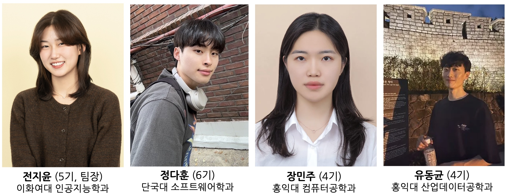
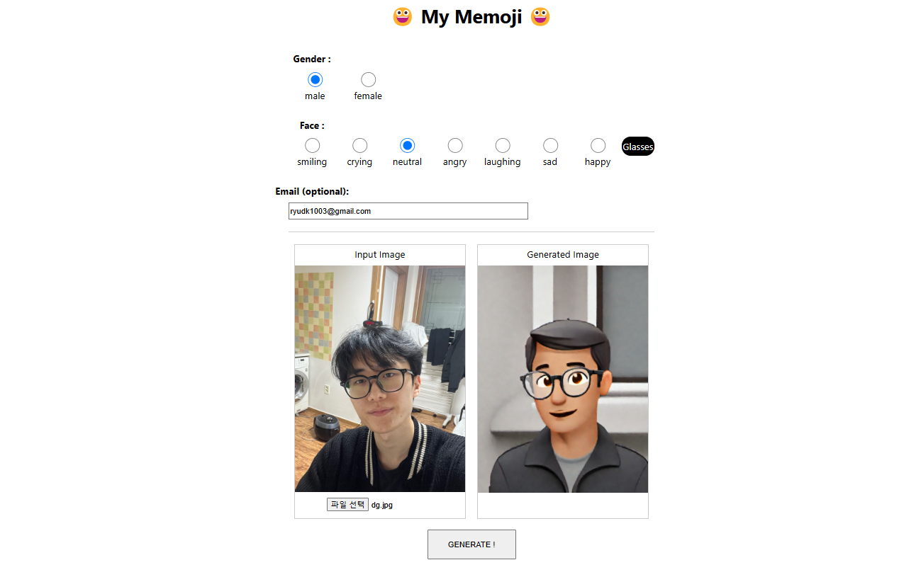
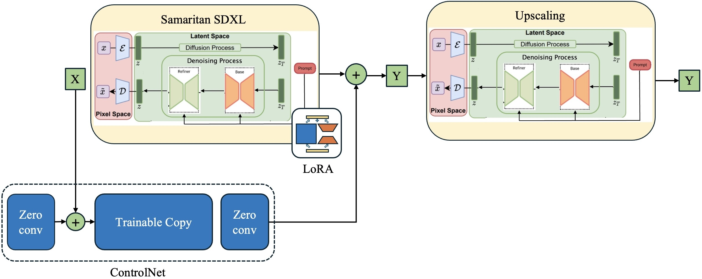
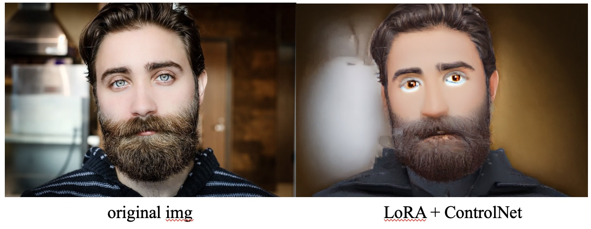

<div align="center">
<h1> MY MEMOJI </h1>
    
[**Jiyoon Jeon**](https://github.com/JuneJe0n) · [**Dahoon Jeong**](https://huggingface.co/baymin0220) · [**Minju Jang**](https://github.com/alswn-03)


</div>


<h2>Introduction</h2>

My Memoji is a service that takes a user photo as input and generates a memoji that resembles the user. <br>
We finetuned SDXL, and improved post-hoc img2img performance using an independent LDM. In addition, we built a custom UI with React. <br>
📄 [Visit our notion for more detail!](https://sparkly-onion-be7.notion.site/My-Memoji-16f8e2ec5d7a81cea547f92474f83cd0?pvs=4)
<br><br>
### 🔥 Motivation <br>
Memoji is Apple’s service that helps users create personalized cartoon-like avatars.
However, due to limited customization options, it’s often difficult to make one that actually resembles yourself. <br>
We aimed to solve this problem by developing a system that automatically generates a memoji resembling you from a single photo.

### 👥 Members
<br><br>

## Installation <br>
### SD WebUI
MyMemoji’s backend UI is built on Automatic1111’s stable-diffusion-webui. Therefore, you need to set up Automatic1111 properly before running MyMemoji WebUI. <br>

**1. Clone the repo**<br>
```
git clone https://github.com/AUTOMATIC1111/stable-diffusion-webui
```
<br>

**2. Download models**<br>
➡️ checkpoint for ControlNet : [diffusers_xl_canny_full.safetensors](https://huggingface.co/lllyasviel/sd_control_collection/blob/main/diffusers_xl_canny_full.safetensors)<br>
➡️ [Download our model checkpoints here](https://drive.google.com/drive/folders/10c-bRDNM-EAHATRaCPTQ3ZGfspJUgASs)<br>
- checkpoint for finetuned Samaritan SDXL : `./Lora/memoji-07.safetensors`<br>
- checkpoint for additional ldm : `./Stable-diffusion/samaritan3dCartoon_v40SDXL.safetensors`<br><br>


**3. Set up files**<br>
Place the downloaded model files in the following structure:

```
└──...── extentions/
│        └── sd-webui-controlnet/
│           └── models/
│              └── diffusers_xl_canny_full.safetensors
│                            
└──...── models/           
│        └── Stable-diffusion/        
|            └── samaritan3dCartoon_v40SDXL.safetensors
│        └── Lora/        
|            └── memoji-07.safetensors
|
```
<br>

**4. Set up api**<br>
Modify your `webui-user.bat` file as follows:
```
@echo off

set PYTHON=
set GIT=
set VENV_DIR=
set COMMANDLINE_ARGS=--api

call webui.bat
```
<br>

**5. Run SD WebUI**<br>
```
./webui.sh --api
```
<br>

### MyMemoji WebUI 
**1. Clone the repo**<br>
```
git clone https://github.com/alswn-03/emoji-generation-webui
```
<br>

**2. Run MyMemoji WebUI**<br>
```
npm start
```
<br>

## How to use MyMemoji WebUI <br>
1️⃣ Upload a photo you want to turn into a memoji. <br>
2️⃣ Select Gender and Face type according to your input image. <br>
3️⃣ (Optional) Enter your email to receive the generated image directly. <br>
4️⃣ Click the Generate button. <br>
✅ Wait until the Progress bar reaches 100% — done! <br>
<br><br>

    
## Model Description
<br>

### 1. base model : <br>
[Samaritan-3d-Cartoon-SDXL](https://huggingface.co/imagepipeline/Samaritan-3d-Cartoon-SDXL)<br>
We chose this model because its cartoon style fits the project’s purpose. <br><br>
<br><br>
  
### 2. Creating the Desired Style (LoRA Finetuning) <br>
The vanilla Samaritan SDXL provided a cartoon look but was far from the emoji style we wanted.
So, we performed LoRA finetuning with 2,748 preprocessed images. <br><br>
<br><br>
🚨 Problem: While the style matched, the generated memoji did not accurately preserve the person’s original facial expression or pose. <br><br>


### 3. Preserving the Original Image (ControlNet w/ Canny Edge) <br>
To fix this, we used edge information from the input photo with ControlNet + Canny Edge to guide generation. <br><br>
<br><br>
🚨 Problem: The model sometimes misinterpreted fine facial details (like double eyelids or under-eye fat) as strong edges, resulting in unwanted artifacts. <br><br>


### 4. Producing Smoother Results (Additional LDM) <br>
To overcome artifacts from step 3, we added an independent LDM to improve post-hoc img2img results.
For empirical reasons, we used the vanilla model as the additional LDM. <br>
- Role of additional LDM:
    - Removes artifacts generated in step 3
    - Improves resolution via upscaling <br><br>
    
<br><br>
✅ Final Result: A memoji that preserves the original photo’s contours while applying the desired emoji style! 🎉 <br><br>


